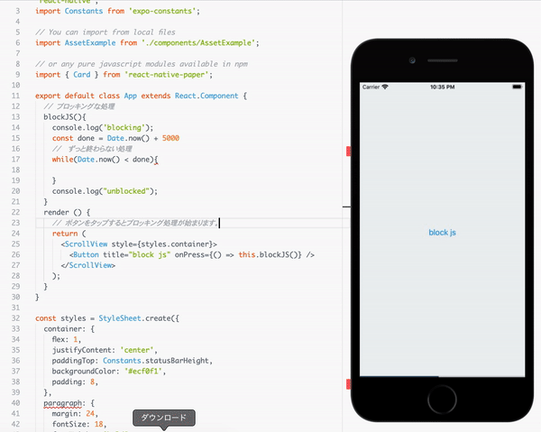

# CS50M -Lecture3 React Native

前回のLectureで学んだトピック
- Classes
- ReactImperative vs Declarative Programming
- Props
- State
- todoApp.js

## React Native
React NativeはReact Coreに依存するフレームワークです。
Reactで使用される構文のおおくは、React Nativeでも使用されます。
また、JavaScriptのみを使用してモバイルアプリを構築できます。

"Learn once, write anywhere"
"一度学べばどこでもかける"

Reactを学べばどんなものでも構築できる。という思想に基づきます。

React Nativeは2つのモバイルプラットフォームに対応します
- iOS
- Android

### どのように動くのか？
- 1つのJavaScriptファイルにバンドルされる
  - コード全体をES5にバージョンダウンし、不要なコードを削減し縮小します。
- スレッドをUI, レイアウト, JavaScript用に分けます
- ブリッジを介して非同期に通信する
  - JSスレッドがUI要素の表示を要求する
  - JSスレッドをブロックしてもUIは機能する

### ブリッジとは？
ReactやJavaScriptなどはどのようにしてビューを表示しているでしょうか。

JavaScriptはコールスタックと呼ばれる仕組みで非同期通信を実現していました。
まずキューに関数を読み込み、スタックに対し順番にプッシュします。
プッシュされた関数は非同期関数ならBrowserAPIに送られ、そこで処理されたものから順番にキューへ戻ってきます。

React NativeではこのBrowserAPIがUI, レイアウトとなります。
それぞれ独立したスレッドを立てているため、仮にJavaScriptでブロッキングな処理を書いてもUIやレイアウトの処理が止まるということはありません。

うえのGIFではボタンをプッシュすると現在時刻が現在時刻 + 5000msを上回れば処理が終了する。いわゆる無限ループを起こすことでブロッキングな処理が始まります。

一度ボタンをプッシュするとJavaScriptの動作は止まり、ボタンは再度押すことができなくなります。
しかし、UIやレイアウトの処理に関しては別のスレッドで走っているため、スクロール操作は普通にできます。

これはあくまでもデモのためにブロッキングな処理を行っただけであり、実際にプログラミングを行う際はノンブロッキングな処理をしてください。

### React NativeとReact Webの違い
- WebではBrowserAPIにある既存のタグを使用して表示させていましたが、React Nativeでは既存のモバイル端末向けコンポーネントを使用します。
- 上の例では`<ScrollView>`や`<Button>`などのコンポーネントをインポート、利用しています。
- BrowserAPIでは自動的にScrollが可能になり、ボタンもHTMLタグがありました。

ネイティブ環境ではJavaScriptは動きません。
つまり、console.logなどすら動かないということですが、React Nativeはこれらの関数のポリフィルを提供しています。

本来、ネイティブにはない機能をJavaScriptと近い形で再現するコードを内部で実行しています。

これは、ブラウザ間でも頻繁に起こることで、fetchが実装されていないブラウザでもさまざまな機能を組み合わせることで近い機能をライブラリとして提供していることもあります。

#### React Native Components
Reactでは`div`や`span`, `p`タグなどにアクセスできました。
しかし、モバイルデバイスではそれらのタグを認識できないため、ReactNativeライブラリからコンポーネントをインポートする必要があります。

| React Web | React Native  |
| ------------ | -------------- |
| div             | View            |
| span          | Text             |
| button        | Button          |
|                  | ScrollView     |

#### React Nativeでのスタイル
React NativeではWebで使用できるHTMLタグが使用できないということがわかりました。
しかし、それだとstyleアトリビュートも使えないしgetElementもできないじゃないか！と思うかもしれません。

React NativeではCSSの概念はありません。
なので、`Key: Value`形式でプロパティを宣言し、それを使用します。
CSSを使用できないと言ってもその形式はCSSに基づいており、`margin`や`padding`などのプロパティを使用できます。

##### レイアウトシステム
React Nativeでのレイアウトシステムは、CSSで言うFlexboxと同様です

##### 長さの単位
Web上のCSSでは`px`や`%`を使用して長さの指定を行っていました。
React Nativeでは単位のない数値を使用しています。

これは、たくさんの異なるデバイスがあるためpxなどで長さの指定を行ってしまうと、あるデバイスではちょうどいい長さなのに他のデバイスではなぜか小さく表示されてしまう。などの問題が起こり得るためです。

### イベントハンドリング

> 助動詞の後ろに来る動詞は必ず動詞の原形になる
> can be 過去分詞
> Mt. Fuji can be seen from my house.
> など、ものを主語にした場合は「物」が何かをsee(みる)事はできないので、
> be seen(見られる)のように受け身の表現にならざるを得ない。

> Represent主語 代表する
> a discrete 動詞？ 個別に別れた
> piece of the UI 目的語 UIを

> Represent 動詞 〜を代表する
>                       〜に相当する
>                 名刺系 representation

> 個別に分けたUIを表す

### コンポーネントをより深く

----- 以下これまでにコンポーネントについて学んだこと
> returned Node(something that can be renderd)
- ノードが返される（返されたノードはレンダリングされる）
> Represent a discrete piece of the UI
>A - 個別に分けたUIを表す
- UIの個別の要素を表現する
> "All React components must act like pure functions with respect to their props."
> A - すべてのリアクトコンポーネントはそれらのpropsをリスペクトした純粋関数のように振る舞わなければならない
- すべてのReactComponentsはそのpropsに関しては純粋な関数のように振る舞わなければならない
  - （純粋関数は関数型における引数に対して副作用のない処理をする関数のこと？）
  - 調べた↓
> 参照透過性（さんしょうとうかせい、英: Referential transparency）は、計算機言語の概念の一種である。ある式が参照透過であるとは、その式をその式の値に置き換えてもプログラムの振る舞いが変わらない(言い換えれば、同じ入力に対して同じ作用と同じ出力とを持つプログラムになる)ことを言う。
> https://ja.wikipedia.org/wiki/%E5%8F%82%E7%85%A7%E9%80%8F%E9%81%8E%E6%80%A7
  - 関数型言語では再代入という概念がなく、一度定義した値は不変
  - つまりはNodeはRenderに返すだけで何かの値に再宣言したりはしないということ？
----- ここまで

#### コンポーネントには2つの種類がある
1つ目は純粋関数。ステートレスコンポーネントと呼ばれるもの。
一切の状態を持たず、ノードのみを返す。

2つ目はReact.Component。

##### ステートレスコンポーネント
Stateless Functional Component (SFC)
前述したように純粋な関数のような振る舞いをし、一切の状態を持たない。
propsを受け取ってノードを帰す以外には何もすべきではない。

